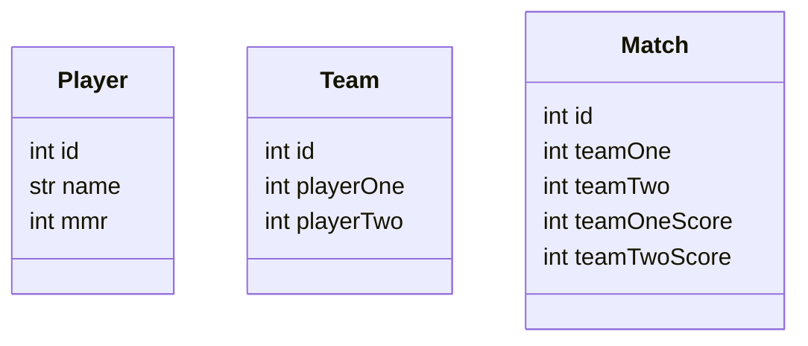

```mermaid
classDiagram
    Player : int id
    Player : str name
    Player : int mmr

    Team : int id
    Team : int playerOne
    Team : int playerTwo

    Match : int id
    Match : int teamOne
    Match : int teamTwo
    Match : int teamOneScore
    Match : int teamTwoScore

    
```
